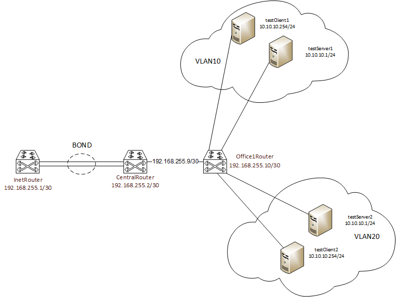

# Vagrant-стенд c VLAN и LACP


### Цель домашнего задания
Научиться настраивать VLAN и LACP.

### Описание домашнего задания
  
в Office1 в тестовой подсети появляется сервера с доп интерфейсами и адресами    
в internal сети testLAN:     
- testClient1 - 10.10.10.254    
- testClient2 - 10.10.10.254    
- testServer1- 10.10.10.1     
- testServer2- 10.10.10.1     

Равести вланами:     
testClient1 <-> testServer1    
testClient2 <-> testServer2     

Между centralRouter и inetRouter "пробросить" 2 линка (общая inernal сеть) и объединить их в бонд, проверить работу c отключением интерфейсов    

Формат сдачи ДЗ - vagrant + ansible      

### Введение
Иногда требуется разделить сеть на несколько подсетей, для этого отлично подходит технология VLAN`ов.     
VLAN (Virtual Local Area Network, виртуальная локальная компьютерная сеть) -  это виртуальные сети, которые работают на втором уровне модели OSI. Протокол VLAN разделяет хосты на подсети, путём добавления тэга к каждому кадру (Протокол 802.1Q).    
Принцип работы VLAN:     
Группа устройств в сети VLAN взаимодействует так, будто устройства подключены с помощью одного кабеля…     
Преимущества использования VLAN:     
Безопасность     
Снижение издержек    
Повышение производительности (уменьшение лишнего трафика)    
Сокращение количества доменов широковещательной рассылки    
Повышение производительности ИТ-отдела    

Пакеты между VLAN могут передаваться только через маршрутизатор или коммутатор 3-го уровня.      
 
Если через один порт требуется передавать сразу несколько VLAN`ов, то используются Trunk-порты.     

Помимо VLAN иногда требуется объединить несколько линков, это делается для увеличения отказоустойчивости.      
Агрегирование каналов (англ. link aggregation) — технологии объединения нескольких параллельных каналов передачи данных в сетях Ethernet в один логический, позволяющие увеличить пропускную способность и повысить надёжность. В различных конкретных реализациях агрегирования используются альтернативные наименования: транкинг портов (англ. port trunking), связывание каналов (link bundling), склейка адаптеров (NIC bonding), сопряжение адаптеров (NIC teaming).     
LACP (англ. link aggregation control protocol) — открытый стандартный протокол агрегирования каналов, описанный в документах IEEE 802.3ad и IEEE 802.1aq.     
Главное преимущество агрегирования каналов в том, что потенциально повышается полоса пропускания: в идеальных условиях полоса может достичь суммы полос пропускания объединенных каналов. Другое преимущество — «горячее» резервирование линий связи: в случае отказа одного из агрегируемых каналов трафик без прерывания сервиса посылается через оставшиеся, а после восстановления отказавшего канала он автоматически включается в работу     

  
## Выполнение    
### 1.  С помощью vagrant развернул тестовый стенд из 7 виртуальных машин:    
|Имя|IP-адрес|VLANID|BONDID|
|-|-|
|inetRouter|192.168.57.10|
|centralRouter|192.168.57.11|
|office1Router|192.168.57.20|
|testClient1|192.168.57.21|
|testServer1|192.168.57.22|
|testClient2|192.168.57.31|
|testServer2|192.168.57.32|
|inetRouter|192.168.255.1||BOND0|
|centralRouter|192.168.255.9|
|centralRouter|192.168.255.2||BOND0|
|office1Router|192.168.255.10|
|testClient1|10.10.10.254|VLAN10|
|testServer1|10.10.10.1|VLAN10|
|testClient2|10.10.10.254|VLAN20|
|testServer2|10.10.10.1|VLAN20|    



### 2. Создал ansible playbook и роли    
Запустил playbook    
```shell
root@ansible:/home/vagrant/ansible# ansible-playbook vlan.yml

PLAY [Base setup for all hosts] *******************************************************************************

TASK [Gathering Facts] ****************************************************************************************
ok: [testServer1]
ok: [testClient1]
ok: [inetRouter]
ok: [testClient2]
ok: [testServer2]
ok: [centralRouter]
...
PLAY RECAP ****************************************************************************************************
centralRouter              : ok=7    changed=5    unreachable=0    failed=0    skipped=1    rescued=0    ignored=0
inetRouter                 : ok=7    changed=5    unreachable=0    failed=0    skipped=1    rescued=0    ignored=0
testClient1                : ok=5    changed=3    unreachable=0    failed=0    skipped=2    rescued=0    ignored=0
testClient2                : ok=5    changed=3    unreachable=0    failed=0    skipped=2    rescued=0    ignored=0
testServer1                : ok=5    changed=3    unreachable=0    failed=0    skipped=2    rescued=0    ignored=0
testServer2                : ok=5    changed=3    unreachable=0    failed=0    skipped=2    rescued=0    ignored=0
```   
Playbook отработал без ошибок    

### 2.3. Далее проверяю результат правильной раскатки playbook   

Проверяю доступность сервера test в vlan10    

```shell
[vagrant@testClient1 ~]$ ping 10.10.10.1
PING 10.10.10.1 (10.10.10.1) 56(84) bytes of data.
64 bytes from 10.10.10.1: icmp_seq=1 ttl=64 time=0.621 ms
64 bytes from 10.10.10.1: icmp_seq=2 ttl=64 time=0.617 ms
64 bytes from 10.10.10.1: icmp_seq=3 ttl=64 time=0.629 ms
64 bytes from 10.10.10.1: icmp_seq=4 ttl=64 time=0.745 ms
64 bytes from 10.10.10.1: icmp_seq=5 ttl=64 time=0.541 ms
64 bytes from 10.10.10.1: icmp_seq=6 ttl=64 time=0.549 ms

--- 10.10.10.1 ping statistics ---
13 packets transmitted, 13 received, 0% packet loss, time 12090ms
rtt min/avg/max/mdev = 0.423/0.603/0.745/0.083 ms
```    

Аналогично для vlan20, но уже со стороны сервера к клиенту    
```shell
vagrant@testServer2:~$ ping 10.10.10.254
PING 10.10.10.254 (10.10.10.254) 56(84) bytes of data.
64 bytes from 10.10.10.254: icmp_seq=1 ttl=64 time=0.795 ms
64 bytes from 10.10.10.254: icmp_seq=2 ttl=64 time=0.413 ms
64 bytes from 10.10.10.254: icmp_seq=3 ttl=64 time=0.485 ms
64 bytes from 10.10.10.254: icmp_seq=4 ttl=64 time=0.488 ms
64 bytes from 10.10.10.254: icmp_seq=5 ttl=64 time=0.494 ms

--- 10.10.10.254 ping statistics ---
5 packets transmitted, 5 received, 0% packet loss, time 4135ms
rtt min/avg/max/mdev = 0.413/0.535/0.795/0.133 ms
```    
Устройства в своих vlan видят друг друга     

### 2.1. Проверка Bond интерфейса между inetRouter и centralRouter с отключением физического интерфейса    
Использовал режим Active-Backup    

```shell
[root@inetRouter ~]# cat /sys/class/net/bond0/bonding/mode
active-backup 1

[root@centralRouter ~]# cat /sys/class/net/bond0/bonding/mode
active-backup 1
```    
```shell
[vagrant@inetRouter ~]$ ip a
1: lo: <LOOPBACK,UP,LOWER_UP> mtu 65536 qdisc noqueue state UNKNOWN group default qlen 1000
    link/loopback 00:00:00:00:00:00 brd 00:00:00:00:00:00
    inet 127.0.0.1/8 scope host lo
       valid_lft forever preferred_lft forever
    inet6 ::1/128 scope host
       valid_lft forever preferred_lft forever
2: eth0: <BROADCAST,MULTICAST,UP,LOWER_UP> mtu 1500 qdisc fq_codel state UP group default qlen 1000
    link/ether 08:00:27:ca:ec:a9 brd ff:ff:ff:ff:ff:ff
    altname enp0s3
    inet 10.0.2.15/24 brd 10.0.2.255 scope global dynamic noprefixroute eth0
       valid_lft 68978sec preferred_lft 68978sec
    inet6 fd00::3b4f:d529:44dd:e2f9/64 scope global dynamic noprefixroute
       valid_lft 86029sec preferred_lft 14029sec
    inet6 fe80::2e1b:2f1:b93b:ba15/64 scope link noprefixroute
       valid_lft forever preferred_lft forever
3: eth1: <BROADCAST,MULTICAST,SLAVE,UP,LOWER_UP> mtu 1500 qdisc fq_codel master bond0 state UP group default qlen 1000
    link/ether 08:00:27:cb:d3:c4 brd ff:ff:ff:ff:ff:ff
    altname enp0s8
4: eth2: <BROADCAST,MULTICAST,SLAVE,UP,LOWER_UP> mtu 1500 qdisc fq_codel master bond0 state UP group default qlen 1000
    link/ether 08:00:27:62:78:7c brd ff:ff:ff:ff:ff:ff
    altname enp0s9
5: eth3: <BROADCAST,MULTICAST,UP,LOWER_UP> mtu 1500 qdisc fq_codel state UP group default qlen 1000
    link/ether 08:00:27:69:45:ba brd ff:ff:ff:ff:ff:ff
    altname enp0s19
    inet 192.168.57.10/24 brd 192.168.57.255 scope global noprefixroute eth3
       valid_lft forever preferred_lft forever
    inet6 fe80::a00:27ff:fe69:45ba/64 scope link
       valid_lft forever preferred_lft forever
6: bond0: <BROADCAST,MULTICAST,MASTER,UP,LOWER_UP> mtu 1500 qdisc noqueue state UP group default qlen 1000
    link/ether 08:00:27:cb:d3:c4 brd ff:ff:ff:ff:ff:ff
    inet 192.168.255.1/30 brd 192.168.255.3 scope global noprefixroute bond0
       valid_lft forever preferred_lft forever
    inet6 fe80::a00:27ff:fecb:d3c4/64 scope link
       valid_lft forever preferred_lft forever
```    
```shell
[vagrant@centralRouter ~]$ ip a
1: lo: <LOOPBACK,UP,LOWER_UP> mtu 65536 qdisc noqueue state UNKNOWN group default qlen 1000
    link/loopback 00:00:00:00:00:00 brd 00:00:00:00:00:00
    inet 127.0.0.1/8 scope host lo
       valid_lft forever preferred_lft forever
    inet6 ::1/128 scope host
       valid_lft forever preferred_lft forever
2: eth0: <BROADCAST,MULTICAST,UP,LOWER_UP> mtu 1500 qdisc fq_codel state UP group default qlen 1000
    link/ether 08:00:27:ca:ec:a9 brd ff:ff:ff:ff:ff:ff
    altname enp0s3
    inet 10.0.2.15/24 brd 10.0.2.255 scope global dynamic noprefixroute eth0
       valid_lft 68920sec preferred_lft 68920sec
    inet6 fd00::e737:4050:c16a:3163/64 scope global dynamic noprefixroute
       valid_lft 86019sec preferred_lft 14019sec
    inet6 fe80::419a:28b1:61bb:86c9/64 scope link noprefixroute
       valid_lft forever preferred_lft forever
3: eth1: <BROADCAST,MULTICAST,SLAVE,UP,LOWER_UP> mtu 1500 qdisc fq_codel master bond0 state UP group default qlen 1000
    link/ether 08:00:27:64:db:89 brd ff:ff:ff:ff:ff:ff
    altname enp0s8
4: eth2: <BROADCAST,MULTICAST,SLAVE,UP,LOWER_UP> mtu 1500 qdisc fq_codel master bond0 state UP group default qlen 1000
    link/ether 08:00:27:ad:64:ec brd ff:ff:ff:ff:ff:ff
    altname enp0s9
5: eth3: <BROADCAST,MULTICAST,UP,LOWER_UP> mtu 1500 qdisc fq_codel state UP group default qlen 1000
    link/ether 08:00:27:6d:97:8d brd ff:ff:ff:ff:ff:ff
    altname enp0s17
    inet 192.168.255.9/30 brd 192.168.255.11 scope global noprefixroute eth3
       valid_lft forever preferred_lft forever
    inet6 fe80::a00:27ff:fe6d:978d/64 scope link
       valid_lft forever preferred_lft forever
6: eth4: <BROADCAST,MULTICAST,UP,LOWER_UP> mtu 1500 qdisc fq_codel state UP group default qlen 1000
    link/ether 08:00:27:91:19:ca brd ff:ff:ff:ff:ff:ff
    altname enp0s19
    inet 192.168.57.11/24 brd 192.168.57.255 scope global noprefixroute eth4
       valid_lft forever preferred_lft forever
    inet6 fe80::a00:27ff:fe91:19ca/64 scope link
       valid_lft forever preferred_lft forever
7: bond0: <BROADCAST,MULTICAST,MASTER,UP,LOWER_UP> mtu 1500 qdisc noqueue state UP group default qlen 1000
    link/ether 08:00:27:64:db:89 brd ff:ff:ff:ff:ff:ff
    inet 192.168.255.2/30 brd 192.168.255.3 scope global noprefixroute bond0
       valid_lft forever preferred_lft forever
    inet6 fe80::a00:27ff:fe64:db89/64 scope link
       valid_lft forever preferred_lft forever
```   
Отключаю на centralRouter интерфейс eth1
```shell
[root@centralRouter ~]# ip link set down eth1
[root@centralRouter ~]# ip -br link
lo               UNKNOWN        00:00:00:00:00:00 <LOOPBACK,UP,LOWER_UP>
eth0             UP             08:00:27:ca:ec:a9 <BROADCAST,MULTICAST,UP,LOWER_UP>
eth1             DOWN           08:00:27:64:db:89 <BROADCAST,MULTICAST,SLAVE>
eth2             UP             08:00:27:ad:64:ec <BROADCAST,MULTICAST,SLAVE,UP,LOWER_UP>
eth3             UP             08:00:27:6d:97:8d <BROADCAST,MULTICAST,UP,LOWER_UP>
eth4             UP             08:00:27:91:19:ca <BROADCAST,MULTICAST,UP,LOWER_UP>
bond0            UP             08:00:27:ad:64:ec <BROADCAST,MULTICAST,MASTER,UP,LOWER_UP>
```   
Запускаю пинг от inetRouter до centralRouter c отключенным на нем интрефейсом eth1    
```shell
[root@inetRouter ~]# ping -c 4 192.168.255.2
PING 192.168.255.2 (192.168.255.2) 56(84) bytes of data.
64 bytes from 192.168.255.2: icmp_seq=1 ttl=64 time=0.787 ms
64 bytes from 192.168.255.2: icmp_seq=2 ttl=64 time=0.529 ms
64 bytes from 192.168.255.2: icmp_seq=3 ttl=64 time=0.400 ms
^C
--- 192.168.255.2 ping statistics ---
3 packets transmitted, 3 received, 0% packet loss, time 2033ms
rtt min/avg/max/mdev = 0.400/0.572/0.787/0.160 ms
```    
Пакеты проходят, Bond работает

____________________________________________________________________     
end


